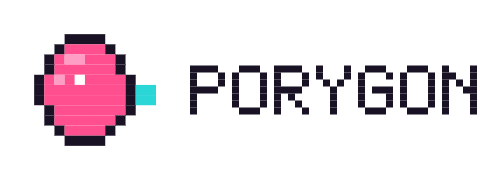

<p align="center">
  <picture>
    <source media="(prefers-color-scheme: dark)"  srcset="assets/porygon-lockup-dark.png">
    <source media="(prefers-color-scheme: light)" srcset="assets/porygon-lockup-light.png">
    
  </picture>
</p>

Tooling for **AI-augmented** pokeemerald decomp ROM hacking. It makes Claude a
capable copilot for the workflows that matter - **debugging**, **creating maps
from images**, and **writing event scripts** - while keeping a human in the
loop. It is not an autonomous game builder.

The value is in the things an LLM can't do reliably by hand:

- **Binary blockdata I/O** - `map.bin` / `border.bin` / `metatile_attributes.bin`
  are packed 16-bit formats. porygon reads and writes them exactly (byte-identical
  round-trip, verified against the full upstream layout set).
- **Image -> map** (phased) - palette quantization, tile dedup, metatile assembly,
  collision suggestions; human reviews in Porymap.
- **Build / debug loop** - build (stock `make` / `make modern`), parse compiler
  errors to `file:line`, resolve crash addresses via `.sym`/`.map`, capture mGBA logs.
- **Event scripting** - generate/validate Poryscript and wire it into map events.
- **Live Porymap bridge** - JavaScript scripts (via Porymap's custom-scripts API)
  so AI-generated blockdata/collision shows up in the editor for review.

## Layout

```
.claude-plugin/   plugin + marketplace manifests
mcp/              Python MCP server + CLI over a pure-core library (uv)
skills/           workflow skills (debug-loop, event-scripting, map-from-image, map-from-image-existing)
agents/           build-doctor, map-architect
commands/         /em-build, /em-debug, /em-map, /em-script
porymap-scripts/  JS bridge loaded via Porymap Options -> Custom Scripts
templates/        CLAUDE.md to drop into a pokeemerald checkout
```

## Status

- **Phase 0 (foundation)** - binary codecs, project parsing, MCP server + CLI, byte-identical round-trip tests.
- **Phase 1 (build/debug loop)** - toolchain-agnostic `build`, compiler-error parsing, and symbol/crash-address resolution (function names from the symbol table; source `file:line` via DWARF when built with `DINFO=1`), plus a thin mGBA launch/GDB helper. `debug-loop` skill + `build-doctor` agent.
- **Phase 2 (event scripting)** - map.json ↔ scripts.inc cross-ref validation (dangling labels, undefined constants), structured event editing (add/remove NPCs/signs/triggers), `.inc` scaffolding, macro-vocabulary lookup, and detected-optional Poryscript compile. Adaptive to hand-written `.inc` or Poryscript. `event-scripting` skill + `script-doctor` agent.
- **Phase 3 (maps from images)** - `image_to_map`: porygon dedups 16×16 cells → metatiles + placement, **Porytiles** compiles the tileset, and a new tileset + layout are written, reviewable in Porymap (with a collision-overlay bridge script). Heuristic collision the human confirms; fork-aware (8 vs 12 tiles/metatile). `map-from-image` skill + `map-architect` agent. Needs `brew install grunt-lucas/porytiles`. Note: viewable in Porymap immediately; building into the ROM needs the new tileset registered in C (not automated).
- **Phase 4 (map wiring)** - the navigation plumbing that ties maps together: `add_warp` (doors/exits, validating the destination map exists and `dest_warp_id` indexes a real warp), `get_connections` / `edit_connection` (stitch N/S/E/W/dive/emerge neighbours, with offset and dest-map validation), `set_map_properties` (weather, music, map_type, battle_scene, and flags - rejecting unknown/structural keys), and `add_bg_event` for the full bg vocabulary (signs, hidden items, secret-base entrances; fork-custom types pass through). All are minimal-diff `map.json` edits with round-trip tests.
- **Phase 5 (recreate a map from an image, reusing existing tilesets)** - `image_to_existing_map`: porygon renders an existing in-project tileset's metatiles back into images and matches each 16×16 cell of a source image (e.g. a map from another game) to the visually-closest metatile (perceptual Lab distance), then writes the layout, registers a walkable **map** (`add_map` + `map_groups.json`), and wires a reciprocal connection so you can walk in and back out. Because it reuses **already-registered** tilesets, a normal `make` builds it into the ROM with no C edits (the `MAP_` constant is auto-generated). Emits a `match_preview.png` and a low-confidence-cell report for review in Porymap. `map-from-image-existing` skill + `map-architect` agent.

That completes the workflows the toolkit set out to augment: **debug, scripting, maps**, and the **map wiring** that connects them - plus recreating a whole location from a reference image using assets you already have.

## Quickstart

```bash
cd mcp && uv sync
# point Claude Code at the plugin, then from a pokeemerald checkout:
uv run porygon info
```

This is an unofficial community tool; it is not affiliated with or endorsed by
pret or the Porymap project.
